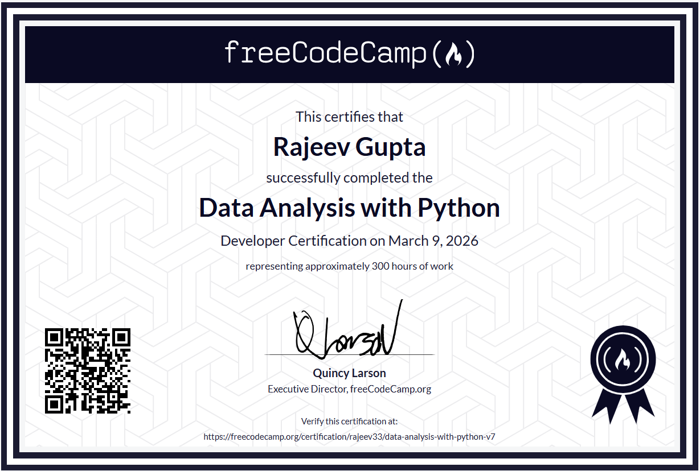
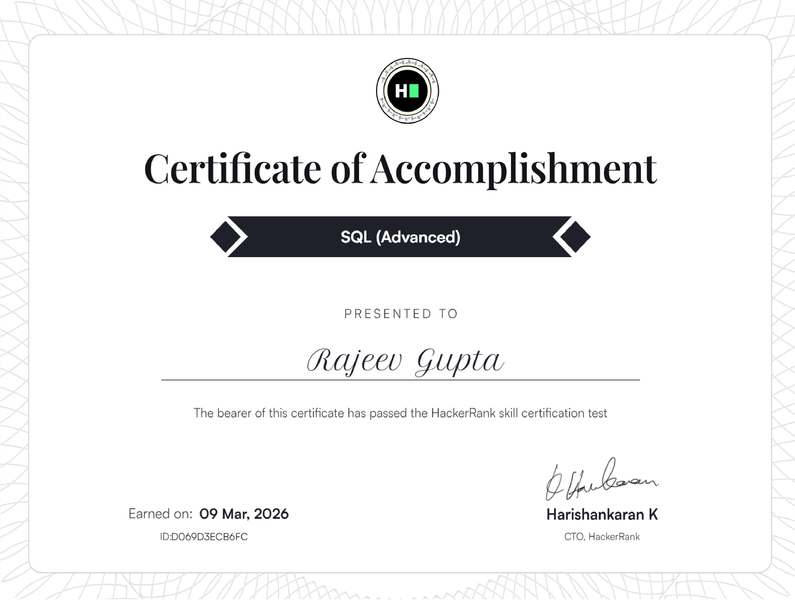

<!-- PROFILE HEADER -->

<h1 align="center">Hi 👋, I'm Rajeev Gupta</h1>

<p align="center">
  
</p>

<p align="center">
  Building intelligent systems combining <b>Computer Science, AI, and Electrical Engineering</b>.
</p>

---

# 🚀 About Me

* 🎓 Engineering graduate with strong background in **Computer Science and Electrical Engineering**
* 💻 Interested in **Systems Programming, Machine Learning, and High Performance Computing**
* ⚡ Experienced in **Power Systems analytics and renewable energy optimization**
* 🧠 Practicing **Data Structures & Algorithms (Dynamic Programming, Advanced Algorithms)**
* 🔬 Building **AI-driven and high-performance engineering systems**

---

# 🧑‍💻 Tech Stack

### Languages

<p>


</p>

---

### Data Science & Machine Learning

<p>


</p>

---

### Systems & Core Computer Science

```
Operating Systems
CPU Scheduling Algorithms
High Performance Log Processing
Data Structures & Algorithms
Dynamic Programming
System Design
```

---

### Power Systems & Signal Processing

```
PV Systems
MPPT Optimization
Power System Event Detection
PMU Data Analytics
Wavelet Transform
Graph Attention Networks
```

---

### Embedded Systems

```
STM32 Microcontrollers
Embedded C
PWM Motor Control
Hardware Interface Programming
Real-time Control Systems
```

---

#  Featured Projects

##  OS Scheduling Algorithm Simulator

Simulation platform for analyzing CPU scheduling algorithms.

Algorithms implemented

* FCFS

* RR

* SPN

* SRT

* HRRN

* FB-1

* FB-2i

* Aging

* CFS

* EDF

Key Concepts

```
Operating Systems
Scheduling Theory
Performance Metrics
```

---

## 🏦 ATM Simulation System

C++ based ATM system implementing real banking operations.

Features

* Authentication
* Withdraw / Deposit
* Balance enquiry
* Persistent storage

Tech

```
C++ | OOP | File Handling
```

---

## 📈 Delhi House Price Prediction

Machine learning model predicting house prices using regression techniques.

Performance

```
R² Score: 0.829
MAE: 0.053
RMSE: 0.082
```

Tech

```
Python | Pandas | Scikit-Learn
```

---

## ☀️ Hybrid PSO-INC MPPT for PV Systems

Optimization algorithm improving photovoltaic system efficiency.

Concepts

```
Particle Swarm Optimization
Incremental Conductance
Renewable Energy Systems
```

---

## ⚡ Power System Event Detection using Graph Attention

Deep learning architecture combining

* Wavelet Transform
* Graph Attention Networks
* Cross Attention Fusion

Goal

```
Noise-resilient power system event detection using PMU data
```

---

## 🔌 STM32 DC Motor Speed & Direction Control

Embedded system controlling motor speed using PWM signals.

Tech

```
STM32 | Embedded C | Microcontroller Programming
```

---

## 🧑‍🎓 Student Course Management Database

Relational database system for managing student records.

Tech

```
SQL | Database Design
```

---

## ⚡ High Performance Log Processing Engine

Efficient log processing engine built for fast parsing and scalable log analysis.

Concepts

```
Memory Efficient Systems
High Throughput Processing
System Programming
```

---

## 🏆 Certifications


## 🏆 Certifications

| Certificate | Issuer | Earned On | Verification |
|---|---|---|---|
| Data Analysis with Python | freeCodeCamp | 2026 | [View Certificate](https://www.freecodecamp.org/certification/rajeev33/data-analysis-with-python-v7) |
| SQL (Advanced) | HackerRank | 09 Mar, 2026 | [View Certificate](https://www.hackerrank.com/certificates/D069D3ECB6FC) |

---

## 📜 Certificate Gallery
### Data Analysis with Python — freeCodeCamp
[](https://www.freecodecamp.org/certification/rajeev33/data-analysis-with-python-v7)
### HackerRank — SQL (Advanced)
[](https://www.hackerrank.com/certificates/D069D3ECB6FC)


<p align="center">

</p>

---

# 🧠 Currently Learning

```
Advanced Dynamic Programming
Graph Neural Networks
System Design
High Performance Computing
```

---

# 🌐 Connect With Me

📧 Email: *(guptarajeev173@gmail.com)*
💼 LinkedIn: *(https://www.linkedin.com/in/rajeev-gupta-976490329/)*

---

